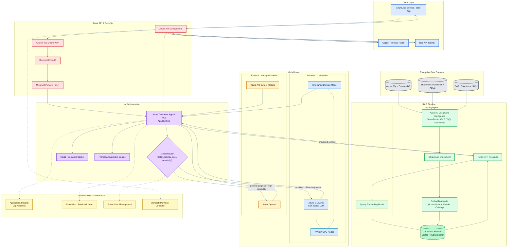
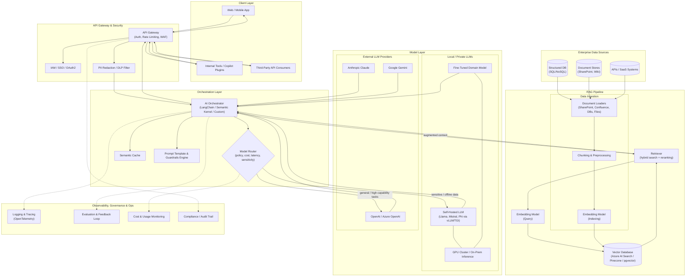
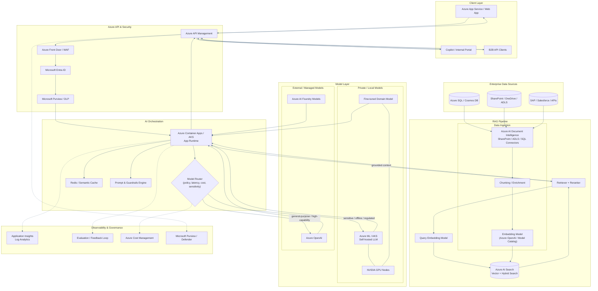
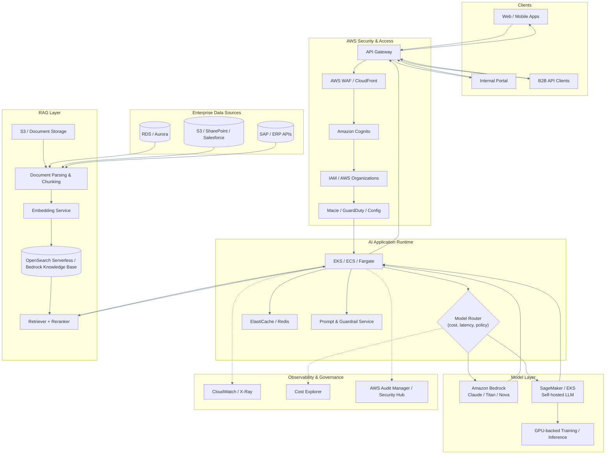
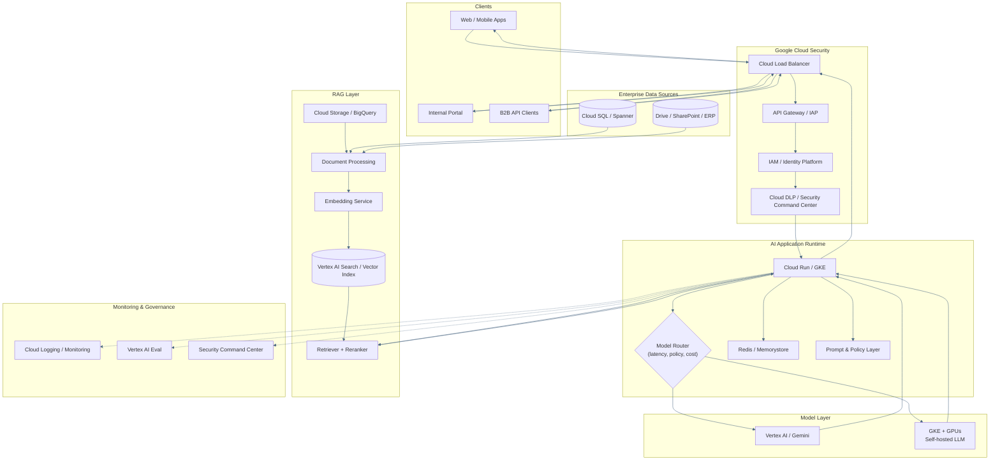
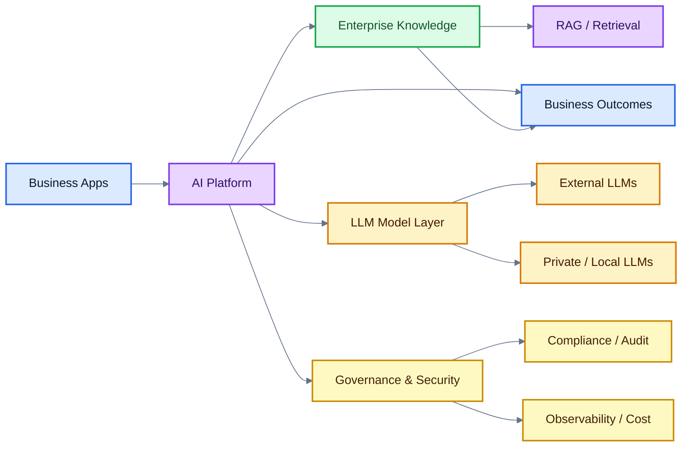

# Enterprise AI Architecture — External LLMs, Local LLMs & RAG

End-to-end reference architecture combining external LLM providers, self-hosted/local LLMs, and a Retrieval-Augmented Generation (RAG) pipeline for enterprise use.

## Diagram



## Diagram Evolution

### 1) Original Generic Architecture



### 2) Improved Azure Architecture



### 3) Final Polished Interactive Version

This is the current version in the main diagram above, with improved readability, color coding, and mouse-friendly pan/zoom enabled.

## Additional Cloud-Native Variants

### 4) AWS-Native Architecture



### 5) GCP-Native Architecture



### 6) Executive-Friendly “CIO View”



### 7) Deeper Deployment Topology with VNet, Private Endpoints, and Network Zones

```mermaid
%%{init: {'theme': 'default', 'themeVariables': { 'primaryColor': '#EFF6FF', 'primaryTextColor': '#0F172A', 'primaryBorderColor': '#2563EB', 'lineColor': '#475569', 'secondaryColor': '#F0FDF4', 'tertiaryColor': '#FEF3C7'}}}%%
flowchart TB
    subgraph Internet["Public Internet"]
        U1["Users / Apps"]
    end

    subgraph Edge["Edge & Access Layer"]
        LB["Azure Front Door / WAF"]
        APIM["API Management"]
        ID["Entra ID / IAM"]
    end

    subgraph DMZ["DMZ / Network Boundary"]
        GW["Ingress Gateway"]
        NAT["NAT / Firewall"]
    end

    subgraph VNet["Virtual Network (Private)]
        subgraph AppSubnet["Application Tier"]
            APP["AI App / Agent Runtime"]
            ORCH["Model Router / Service Mesh"]
        end

        subgraph AISubnet["AI / Compute Tier"]
            LLM["Private LLM Runtime"]
            GPU["GPU Cluster"]
        end

        subgraph DataSubnet["Data & Retrieval Tier"]
            AISEARCH["AI Search / Vector DB"]
            SQL["Azure SQL / Cosmos DB"]
            KV["Key Vault"]
        end

        subgraph GovSubnet["Observability & Security"]
            LOG["Log Analytics / App Insights"]
            PURVIEW["Purview / Defender"]
        end
    end

    subgraph PE["Private Endpoints / Private Link"]
        PE1["Private Endpoint: SQL"]
        PE2["Private Endpoint: Storage"]
        PE3["Private Endpoint: AI Search"]
        PE4["Private Endpoint: Key Vault"]
    end

    subgraph Zones["Availability Zones"]
        Z1["Zone 1"]
        Z2["Zone 2"]
        Z3["Zone 3"]
    end

    U1 --> LB --> APIM --> ID
    ID --> GW --> NAT --> APP
    APP --> ORCH
    ORCH --> LLM
    LLM --> GPU
    ORCH --> AISEARCH
    ORCH --> SQL
    APP --> KV

    SQL --> PE1
    AISEARCH --> PE3
    KV --> PE4
    PE2 --> APP

    APP --> LOG
    ORCH --> PURVIEW

    Z1 --> APP
    Z2 --> ORCH
    Z3 --> LLM
```

## Layer Descriptions

### Client Layer
Entry points for end users and systems: web/mobile apps, internal tooling (e.g. Copilot plugins), and third-party API consumers.

### API Gateway & Security
- **API Gateway** — authentication, rate limiting, WAF protection.
- **IAM / SSO / OAuth2** — identity and access control.
- **PII Redaction / DLP Filter** — strips or masks sensitive data before it reaches the orchestrator.

### Orchestration Layer
- **AI Orchestrator** — coordinates prompt construction, retrieval, model routing, and response assembly (e.g. LangChain, Semantic Kernel).
- **Model Router** — chooses between local and external LLMs based on policy, cost, latency, and data sensitivity.
- **Semantic Cache** — avoids redundant model calls for repeated/similar queries.
- **Prompt Template & Guardrails Engine** — enforces prompt structure, safety filters, and output validation.

### RAG Pipeline
- **Ingestion** — document loaders pull from enterprise sources, chunk content, and generate embeddings for indexing.
- **Vector Database** — stores embeddings (e.g. Azure AI Search, Pinecone, pgvector).
- **Retriever** — hybrid search (vector + keyword) with reranking, triggered at query time via a query embedding model.

### Model Layer
- **Local / Private LLMs** — self-hosted or fine-tuned models (Llama, Mistral, Phi) served via vLLM/TGI on a GPU cluster; used for sensitive or offline workloads.
- **External LLM Providers** — OpenAI/Azure OpenAI, Anthropic Claude, Google Gemini; used for general-purpose, high-capability tasks.

### Enterprise Data Sources
Structured databases, document stores (SharePoint, wikis), and internal/external APIs feeding the ingestion pipeline.

### Observability, Governance & Ops
- **Logging & Tracing** — end-to-end request tracing (OpenTelemetry).
- **Evaluation & Feedback Loop** — quality scoring and human feedback capture.
- **Cost & Usage Monitoring** — tracks spend and usage per model/route.
- **Compliance / Audit Trail** — records access and decisions for regulatory needs.

## Routing Logic Summary
| Condition | Routed To |
|---|---|
| Sensitive/regulated data, offline requirement, cost-sensitive high-volume | Local LLM |
| General reasoning, high capability, low data sensitivity | External LLM |
