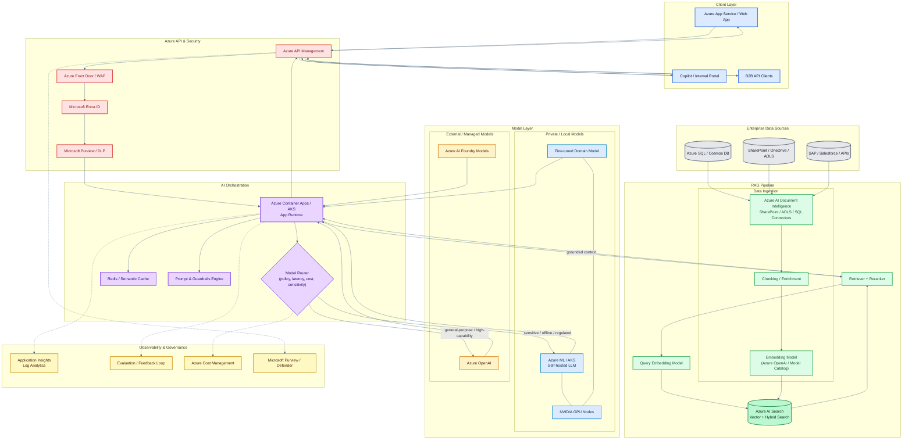
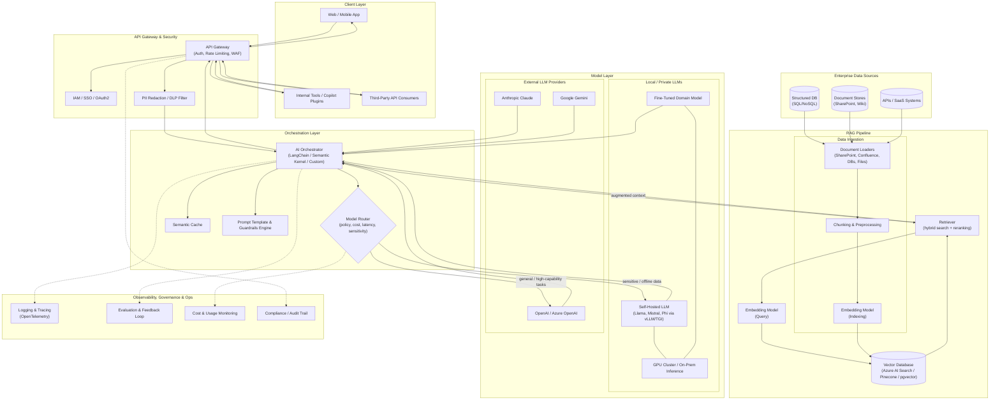
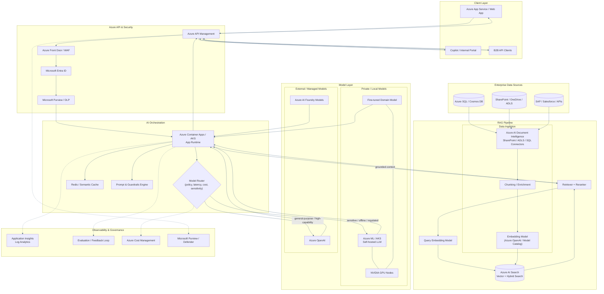

# Enterprise AI Architecture — External LLMs, Local LLMs & RAG

End-to-end reference architecture combining external LLM providers, self-hosted/local LLMs, and a Retrieval-Augmented Generation (RAG) pipeline for enterprise use.

## Diagram

## Diagram Evolution

### 1) Original Generic Architecture

### 2) Improved Azure Architecture

### 3) Final Polished Interactive Version

This is the current version in the main diagram above, with improved readability, color coding, and mouse-friendly pan/zoom enabled.

## Layer Descriptions

### Client Layer
Entry points for end users and systems: web/mobile apps, internal tooling (e.g. Copilot plugins), and third-party API consumers.

### API Gateway & Security
- **API Gateway** — authentication, rate limiting, WAF protection.
- **IAM / SSO / OAuth2** — identity and access control.
- **PII Redaction / DLP Filter** — strips or masks sensitive data before it reaches the orchestrator.

### Orchestration Layer
- **AI Orchestrator** — coordinates prompt construction, retrieval, model routing, and response assembly (e.g. LangChain, Semantic Kernel).
- **Model Router** — chooses between local and external LLMs based on policy, cost, latency, and data sensitivity.
- **Semantic Cache** — avoids redundant model calls for repeated/similar queries.
- **Prompt Template & Guardrails Engine** — enforces prompt structure, safety filters, and output validation.

### RAG Pipeline
- **Ingestion** — document loaders pull from enterprise sources, chunk content, and generate embeddings for indexing.
- **Vector Database** — stores embeddings (e.g. Azure AI Search, Pinecone, pgvector).
- **Retriever** — hybrid search (vector + keyword) with reranking, triggered at query time via a query embedding model.

### Model Layer
- **Local / Private LLMs** — self-hosted or fine-tuned models (Llama, Mistral, Phi) served via vLLM/TGI on a GPU cluster; used for sensitive or offline workloads.
- **External LLM Providers** — OpenAI/Azure OpenAI, Anthropic Claude, Google Gemini; used for general-purpose, high-capability tasks.

### Enterprise Data Sources
Structured databases, document stores (SharePoint, wikis), and internal/external APIs feeding the ingestion pipeline.

### Observability, Governance & Ops
- **Logging & Tracing** — end-to-end request tracing (OpenTelemetry).
- **Evaluation & Feedback Loop** — quality scoring and human feedback capture.
- **Cost & Usage Monitoring** — tracks spend and usage per model/route.
- **Compliance / Audit Trail** — records access and decisions for regulatory needs.

## Routing Logic Summary
| Condition | Routed To |
|---|---|
| Sensitive/regulated data, offline requirement, cost-sensitive high-volume | Local LLM |
| General reasoning, high capability, low data sensitivity | External LLM |
