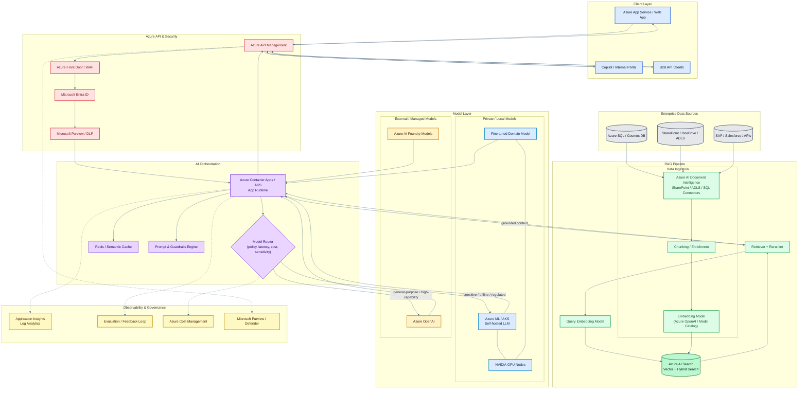
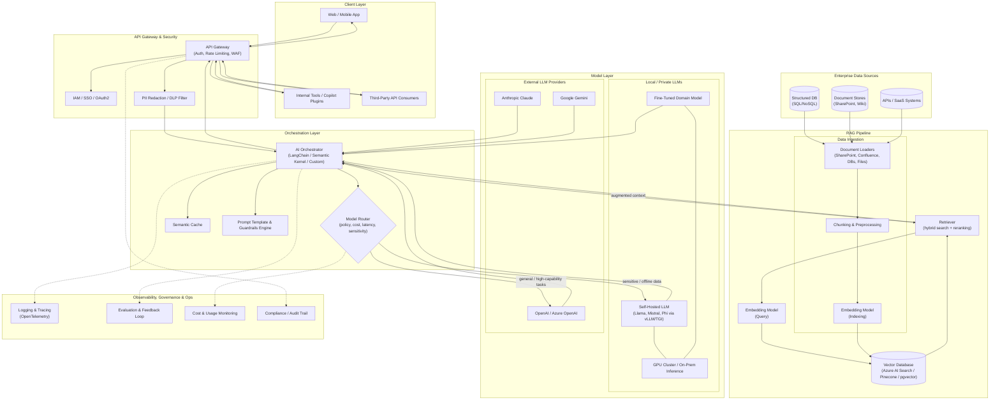
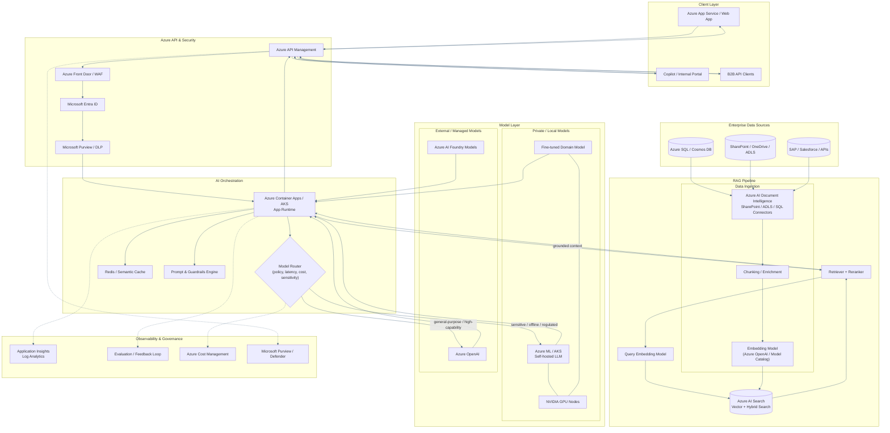
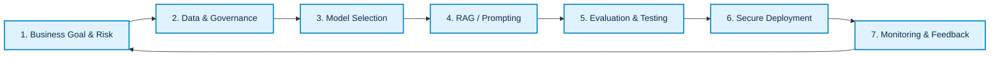
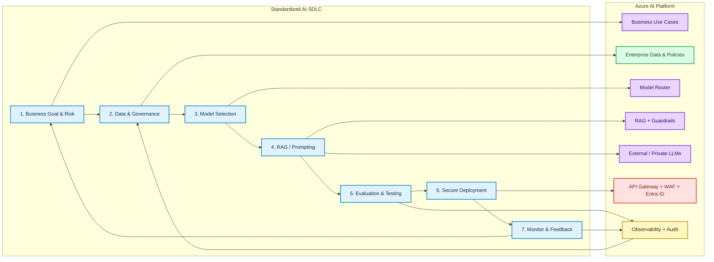
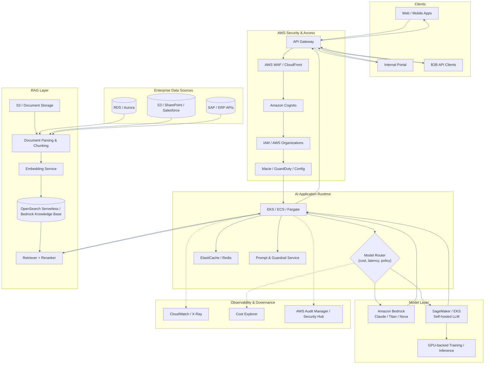
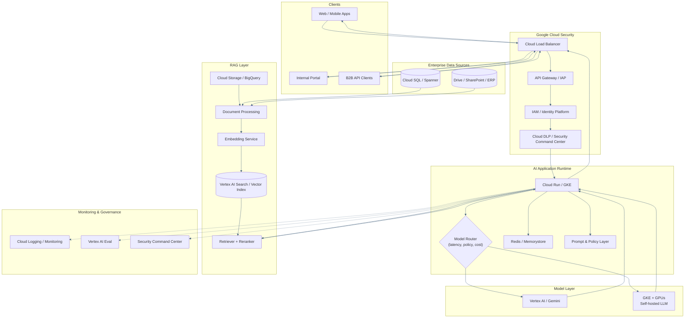
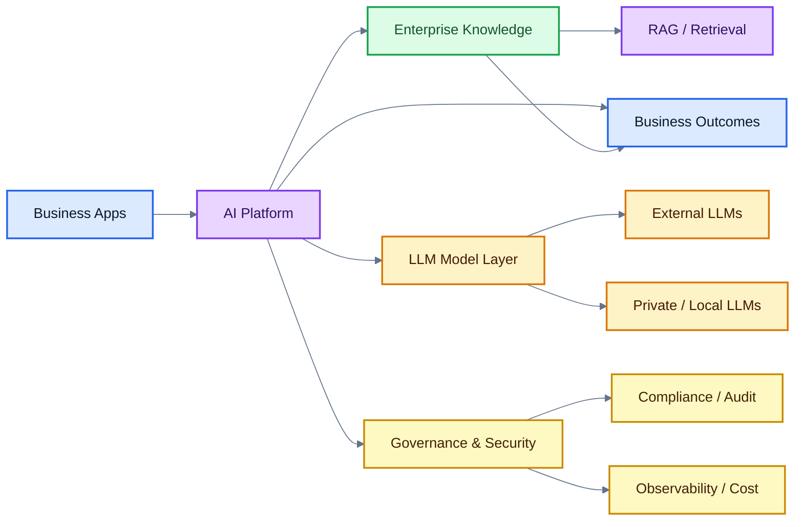
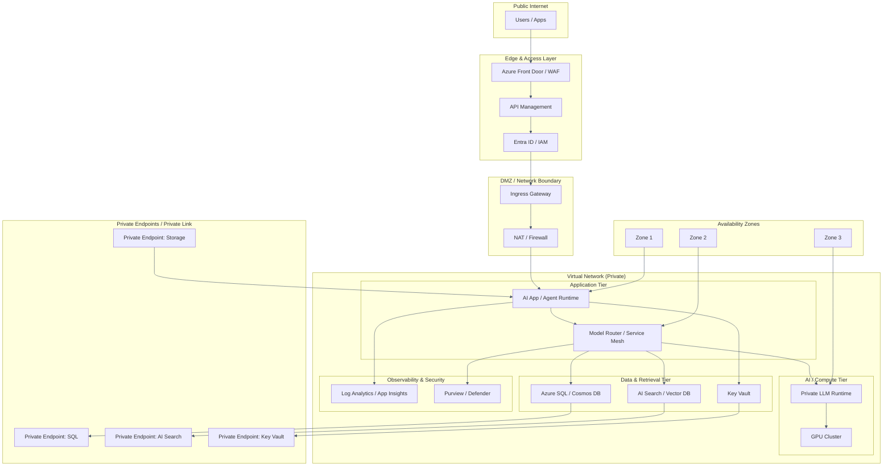

# Enterprise AI Architecture: External LLMs, Local LLMs, and RAG

End-to-end reference architecture combining external managed LLMs, private or self-hosted LLMs, and a Retrieval-Augmented Generation (RAG) pipeline for enterprise use.

## Contents

- [Reference Architecture](#reference-architecture)
- [Architecture Evolution](#architecture-evolution)
- [Standardized AI SDLC](#standardized-ai-sdlc)
- [Cloud-Native Variants](#cloud-native-variants)
- [Executive CIO View](#executive-cio-view)
- [Deployment Topology](#deployment-topology)
- [Cloud Platform Comparison](#cloud-platform-comparison)
- [Architecture Layers](#architecture-layers)
- [Routing Logic](#routing-logic)

## Reference Architecture

## Architecture Evolution

### Original Generic Architecture

### Improved Azure Architecture

## Standardized AI SDLC

A standardized AI SDLC is the repeatable lifecycle used to design, build, validate, deploy, and govern enterprise AI systems with traceability and controls.

This lifecycle governs the platform continuously rather than acting as a one-time project checklist:

- Business goals and risk classification precede model routing and deployment.
- Data governance applies before, during, and after RAG ingestion.
- Model selection is handled by the router across private and managed LLMs.
- Prompting, grounding, and retrieval are controlled by the guardrails layer.
- Evaluation uses automated scoring, human feedback, and safety checks before release.
- Secure deployment uses the gateway, identity, WAF, DLP, and audit controls.
- Monitoring closes the loop through telemetry, cost tracking, drift detection, and content refresh.

### SDLC Overlay on the Azure Architecture

This overlay shows the SDLC as the operating model that governs the platform. The architecture provides the execution path; the SDLC governs data, model choice, evaluation, deployment, and continuous improvement.

## Cloud-Native Variants

### AWS-Native Architecture

### GCP-Native Architecture

## Executive CIO View

## Deployment Topology

The following topology adds private networking, subnet boundaries, private endpoints, and availability zones for a regulated Azure deployment.

## Cloud Platform Comparison

| Capability | Azure | AWS | GCP |
|---|---|---|---|
| Identity & access | Microsoft Entra ID | Cognito + IAM | IAM + Identity Platform |
| Edge / ingress | Azure Front Door, API Management | CloudFront, API Gateway | Cloud Load Balancer, API Gateway / IAP |
| App runtime | Container Apps, AKS | EKS, ECS, Fargate | Cloud Run, GKE |
| Managed model layer | Azure OpenAI, Azure AI Foundry | Bedrock | Vertex AI, Gemini |
| Private / local models | Azure ML + AKS + GPU | SageMaker + EKS + GPU | GKE + GPU |
| Vector / RAG store | Azure AI Search | OpenSearch Serverless, Bedrock KB | Vertex AI Search, Vector Index |
| Structured data | Azure SQL, Cosmos DB | RDS, Aurora | Cloud SQL, Spanner |
| Object / document storage | ADLS, SharePoint | S3 | Cloud Storage |
| Governance | Purview, Defender | GuardDuty, Security Hub | Security Command Center |
| Observability | App Insights, Log Analytics | CloudWatch, X-Ray | Cloud Logging, Monitoring |
| Network isolation | VNet + Private Endpoints | VPC + PrivateLink | VPC + Private Service Connect |

## Architecture Layers

### Client Layer
Entry points for end users and systems: web applications, internal portals, enterprise copilots, and third-party API consumers.

### API Gateway & Security
- **API gateway** — authentication, rate limiting, and traffic control.
- **IAM / SSO / OAuth2** — identity and access control.
- **DLP and PII controls** — prevent sensitive data from reaching the orchestrator or model layer without policy enforcement.

### Orchestration Layer
- **AI orchestrator** — coordinates prompt construction, retrieval, model routing, and response assembly.
- **Model router** — chooses between local and external LLMs based on policy, cost, latency, and data sensitivity.
- **Semantic cache** — avoids redundant model calls for repeated or similar queries.
- **Prompt and guardrails engine** — enforces prompt structure, safety filters, and output validation.

### RAG Pipeline
- **Ingestion** — document loaders pull from enterprise sources, normalize content, and generate embeddings for indexing.
- **Vector database** — stores embeddings and supports hybrid search and semantic retrieval.
- **Retriever** — combines vector and keyword search with reranking before grounding the model response.

### Model Layer
- **Local / private LLMs** — self-hosted or fine-tuned models served on private GPU infrastructure for sensitive, regulated, or offline workloads.
- **External / managed LLMs** — managed providers used for general-purpose tasks requiring broad capability.

### Enterprise Data Sources
Structured databases, document repositories, and SaaS or internal APIs feed the ingestion and grounding pipeline.

### Observability, Governance & Ops
- **Logging and tracing** — end-to-end request visibility.
- **Evaluation and feedback** — quality scoring and human feedback capture.
- **Cost and usage monitoring** — spend, latency, and route selection by model.
- **Compliance and audit** — access records and decision traceability for regulated workloads.

## Routing Logic

| Condition | Preferred route |
|---|---|
| Sensitive or regulated data, offline requirement, or cost-sensitive high-volume workloads | Local / private LLM |
| General reasoning, broad capability, and lower data sensitivity | External / managed LLM |

## Final Notes

This architecture balances three enterprise priorities:

- Security and compliance
- Performance and cost control
- Quality and governability through RAG, evaluation, and telemetry

Separating ingestion, retrieval, orchestration, model selection, and monitoring keeps the platform modular, auditable, and scalable as AI workloads mature.
